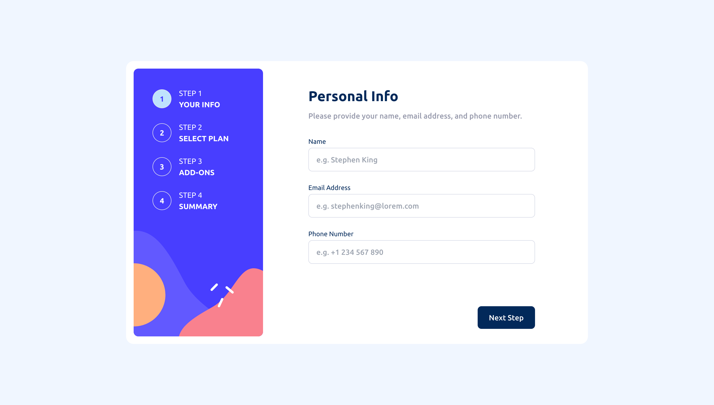
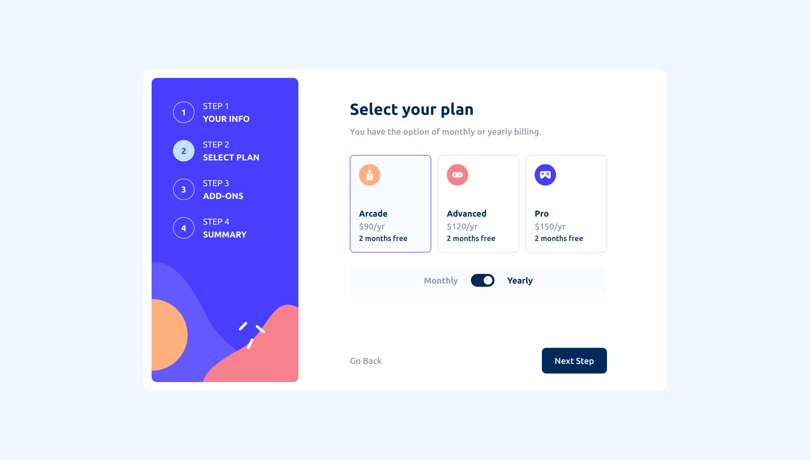
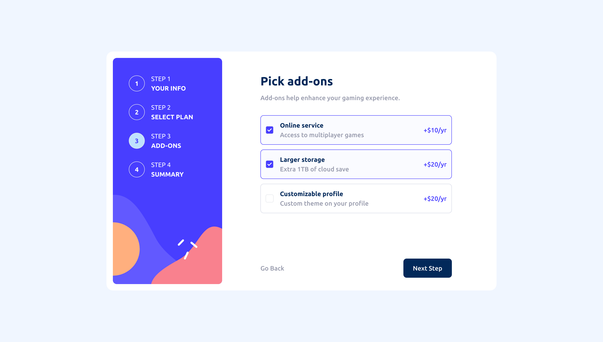
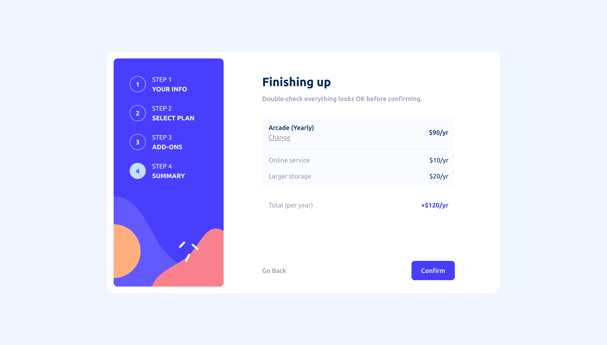
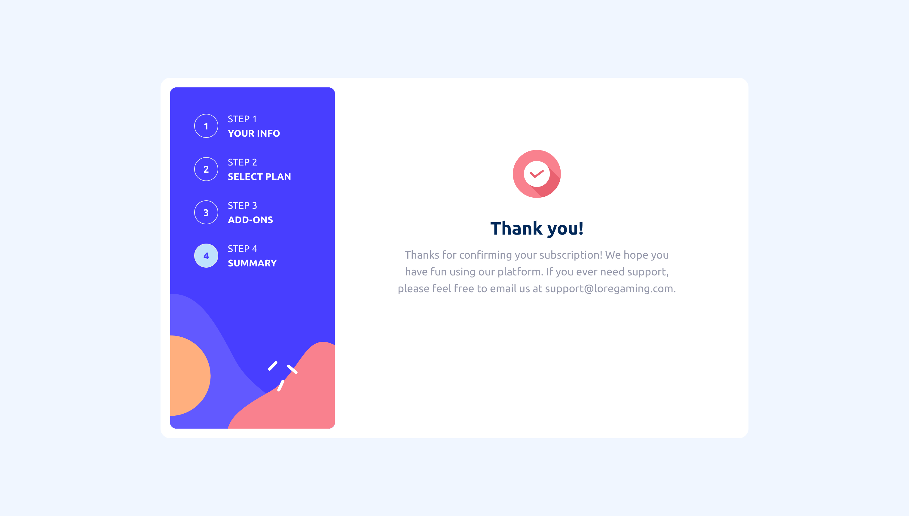
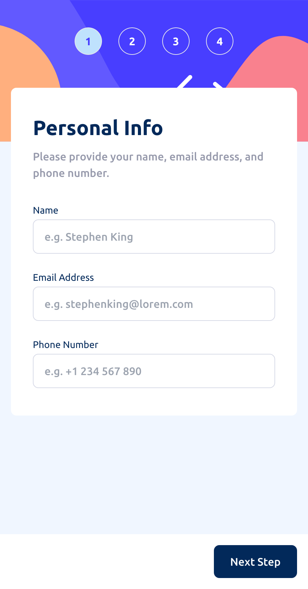
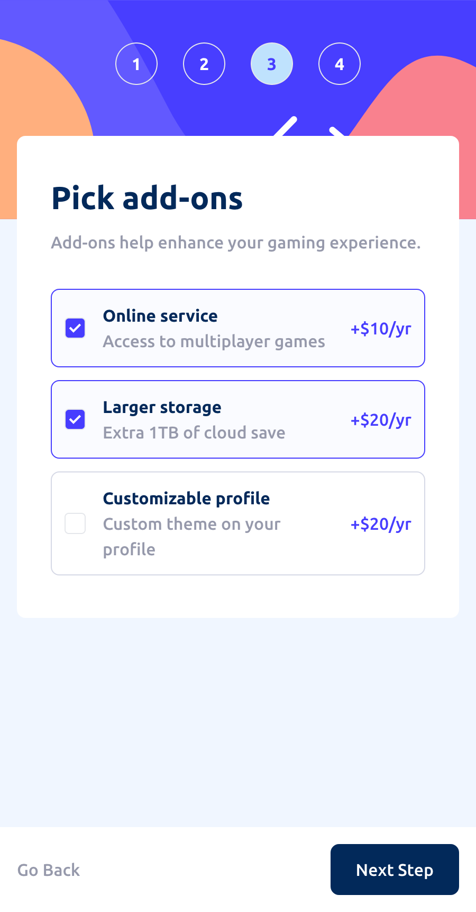
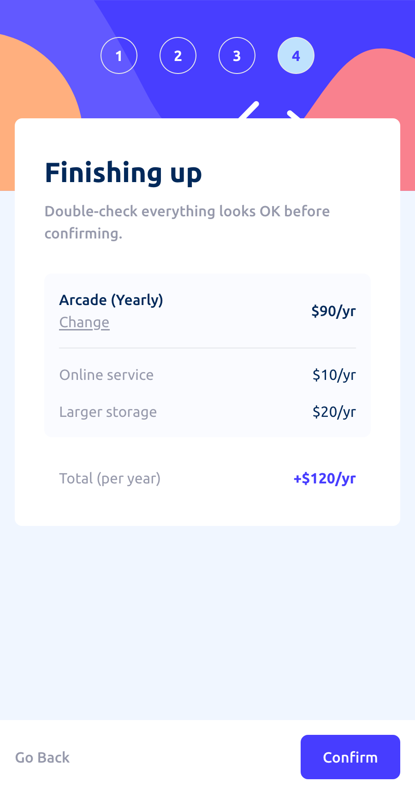

# Frontend Mentor - Multi-step form solution

This is a solution to the [Multi-step form challenge on Frontend Mentor](https://www.frontendmentor.io/challenges/multistep-form-YVAnSdqQBJ). Frontend Mentor challenges help you improve your coding skills by building realistic projects.

## Table of contents

- [Overview](#overview)
  - [The challenge](#the-challenge)
  - [Screenshots](#screenshots)
  - [Links](#links)
- [Built with](#built-with)

## Overview

### The challenge

Users should be able to:

- Complete each step of the sequence
- Go back to a previous step to update their selections
- See a summary of their selections on the final step and confirm their order
- View the optimal layout for the interface depending on their device's screen size
- See hover and focus states for all interactive elements on the page
- Receive form validation messages if:
  - A field has been missed
  - The email address is not formatted correctly
  - A step is submitted, but no selection has been made

### Screenshots

### Links

- Solution URL: [github.com/stay-js/fm-multi-step-form](https://github.com/stay-js/fm-multi-step-form)
- Live Site URL: [fm-multi-step-form.znagy.hu](https://fm-multi-step-form.znagy.hu)

## Built with

- **Deployment**: [Vercel](https://vercel.com)
- [Next.js](https://nextjs.org)
- [React Hook Form](https://react-hook-form.com)
- [Zod](https://zod.dev)
- [Headless UI](https://headlessui.dev)
- [Tailwind CSS](https://tailwindcss.com)
